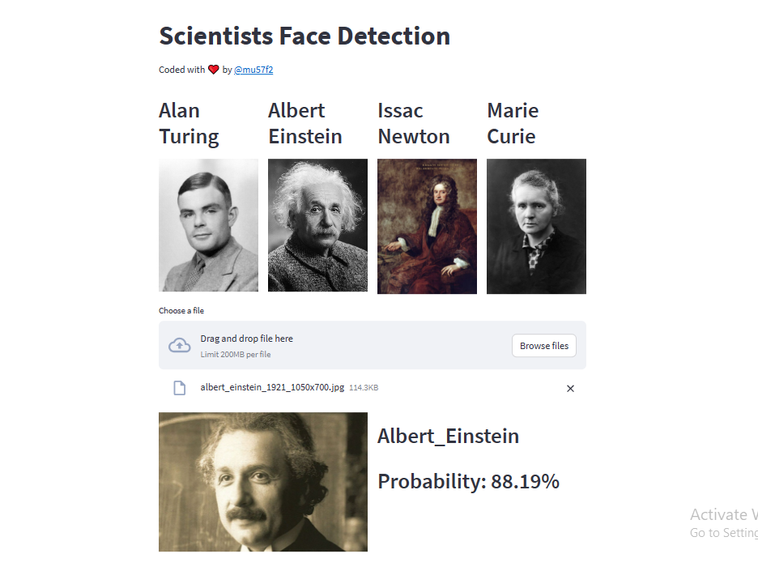
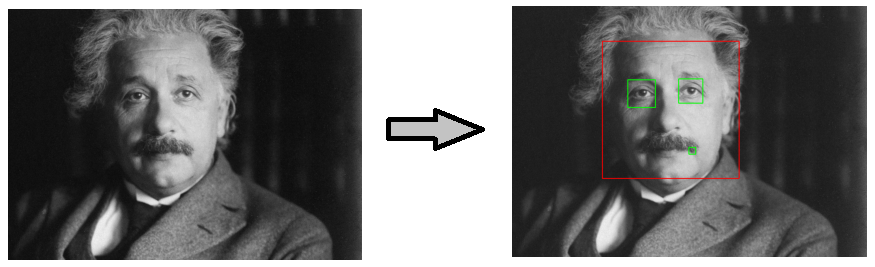

In this project, we classify scientists faces, classification restricted to only these 4 scientists:
1. Alan Turing
2. Albert Einstein
3. Issac Newton
4. Marie Curie

## Dataset:
This dataset collected by scrape google for images using chrome extension `Fatkun`.

Data was cleaned by detecing faces and eyes in the image and extract only that region




## Application:
the `application` folder contains the code for streamlit application.

First
```
pip instal -r requirments.txt
```

Then go to `application` folder and run
```
streamlit run app.py
```